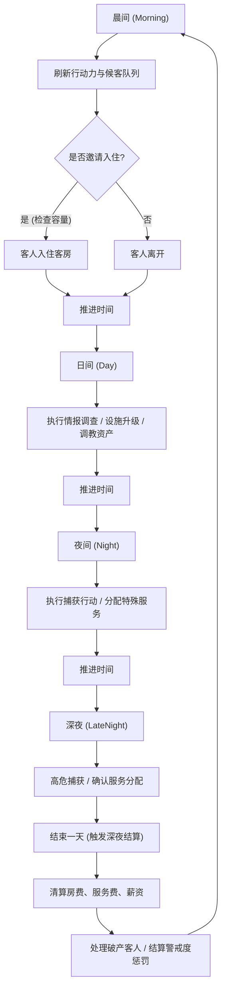

## 1. 产品概述
《迷迭香酒馆》是一款暗黑奇幻背景下的成人向模拟经营与策略养成网页游戏。
玩家扮演流亡灰烬荒原的黑帮头目，经营一家黑店，通过接待客人、调查情报、捕获资产以及提供特殊服务来建立自己的地下帝国。

## 2. 核心功能

### 2.1 用户角色
| 角色 | 注册方式 | 核心权限 |
|------|---------------------|------------------|
| 玩家 (酒馆老板) | 无需注册 (本地存档) | 经营酒馆，管理资产，执行所有互动操作 |

### 2.2 核心模块
1. **主控制台 (Main Dashboard)**：显示核心资源（金币、行动力AP、特殊建材、声望、警戒度）及当前时间阶段。
2. **接待与访客模块 (Reception)**：晨间生成候客队列，玩家查看排队访客的基础信息并决定是否邀请入住。
3. **互动与调查模块 (Interaction & Intel)**：日间/夜间消耗行动力对入住客人进行调查，揭露弱点、阵营、XP偏好及财力。
4. **捕获与调教模块 (Capture & Train)**：夜间/深夜对女性目标执行下药、武力或诱骗等捕获行动；对已捕获资产进行调教以提升服从度和魅力值。
5. **服务分配与结算模块 (Service & Settlement)**：为男性客人分配女性资产提供特殊服务；深夜强制结算，清算各项费用。
6. **建设与研发模块 (Build & Research)**：升级地上/地下设施，并消耗金币解锁网状技能图谱。

### 2.3 页面详细说明
| 页面/面板名称 | 模块名称 | 功能描述 |
|-----------|-------------|---------------------|
| 主界面 | 顶部状态栏 | 展示时间、天数、金币、AP、警戒度等全局资源。 |
| 主界面 | 场景视图 | 展示当前酒馆场景（大堂/客房区/地下密室），并根据时间段切换光影。 |
| 主界面 | 访客列表侧边栏 | 显示当前候客队列或已入住客人的列表及简略状态。 |
| 交互弹窗 | 客人详情卡片 | 显示客人的公开属性与隐藏情报，提供调查、推销、捕获、雇佣等交互按钮。 |
| 资产管理面板 | 地下暗房 | 浏览已捕获的女性资产列表，执行调教训练或分配接客服务。 |
| 结算面板 | 深夜账单 | 每日结束时弹出，结算房费、服务费、员工薪资及净利润，并处理付不起钱的客人。 |
| 设施与天赋页 | 升级图谱 | 全屏面板，展示设施的分支升级路线及4个Tier的网状技能树。 |

## 3. 核心流程
玩家每天在四个时间阶段中循环操作，合理分配行动力，榨取最大利润并避免警戒度过高。

## 4. 用户界面设计

### 4.1 设计风格
- **整体氛围**：典雅暗黑奇幻 (Elegant Dark Fantasy)、神秘、奢华且带有一丝危险气息。
- **色彩搭配**：
  - 主色调：深邃的黑灰背景 (#121212, #1C1C1E)。
  - 点缀色：暗金色 (#B89745) 用于强调高贵与金币，猩红色 (#8B0000) 用于警告、警戒度及捕获等危险操作。
  - 辅助色：冷幽的紫色或蓝色用于魔法/炼金相关元素。
- **按钮样式**：带有金属质感边框或微发光效果的扁平化卡片，交互时有平滑的描边高亮过渡。
- **字体与排版**：使用典雅的衬线体（Serif）作为标题字体（如 Playfair Display 或 Cinzel 风格），正文使用清晰的无衬线体（Sans-serif）。
- **图标风格**：精致的线框图标，带有古典花纹装饰。

### 4.2 页面设计概览
| 页面名称 | 模块名称 | UI元素设计 |
|-----------|-------------|-------------|
| 主控制台 | 顶部导航栏 | 采用羊皮纸或暗金边框质感的资源槽位，数值变动时带有淡入淡出动画。 |
| 主控制台 | 客人列表 | 竖向卡片列表，稀有度使用不同颜色的边框（N-灰, R-蓝, SR-紫, SSR-金）。 |
| 详情面板 | 交互面板 | 模态框(Modal)设计，左侧为角色立绘/属性，右侧为可用操作及成功率预估。隐藏情报用“未知”或模糊效果遮挡，调查后翻牌显示。 |
| 结算页面 | 账单明细 | 类似古典账本的形式，各项收入为绿色/金色，支出为红色，底部显示总计印章。 |

### 4.3 响应式设计
- **优先策略**：桌面端优先 (Desktop-first)。游戏包含大量信息层级与数值面板，建议在宽屏下体验以获得最佳的沉浸感与布局分布。
- 移动端适配：将左右两侧面板改为抽屉式(Drawer)呼出，居中显示核心场景。

### 4.4 视觉与素材应用
- 生成高质量的典雅暗黑风格背景图（如酒馆大堂、地下暗室）。
- 生成代表不同阶层、种族客人的头像/立绘剪影。
- 采用精致的 CSS 动画（如深夜结算时的账单印章砸下效果，捕获成功时的猩红闪光）。
