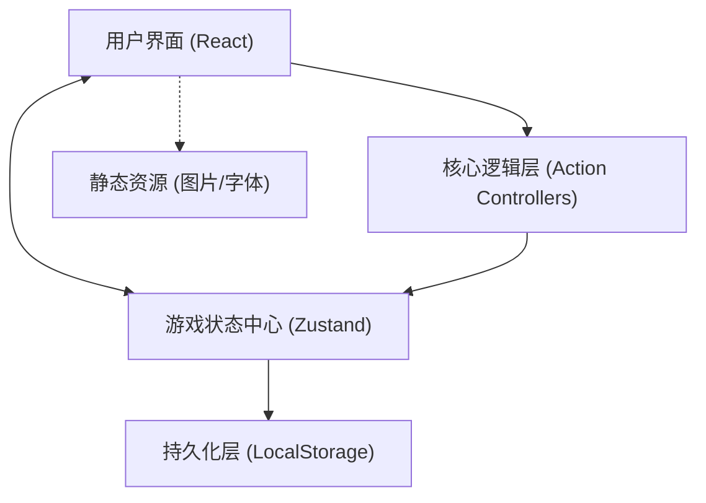
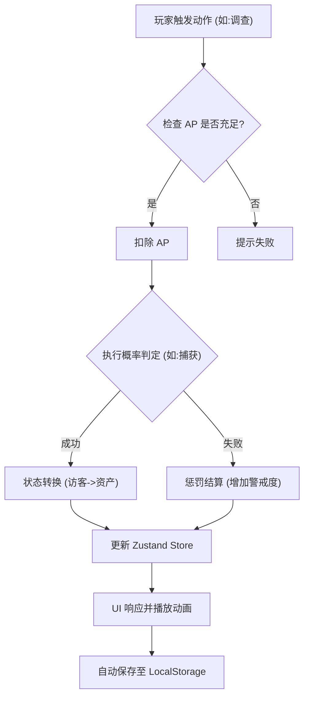
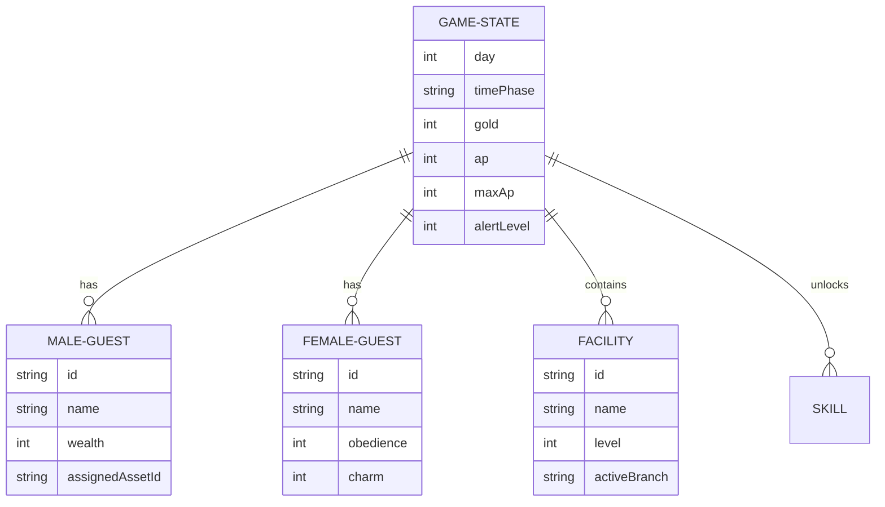

## 1. 架构设计
《迷迭香酒馆》是一个纯前端网页游戏。状态持久化和核心逻辑均在客户端通过状态管理库和 LocalStorage 实现。



## 2. 技术栈说明
- **前端框架**: React@18 + TypeScript + Vite
- **UI 样式**: Tailwind CSS@3 + `clsx`/`tailwind-merge`
- **状态管理**: Zustand (用于管理天数、资源、角色、设施状态)
- **动画库**: Framer Motion (用于暗黑典雅风格的转场、面板弹出、数值变化动画)
- **图标库**: Lucide React
- **持久化**: `zustand/middleware/persist`

## 3. 路由定义
| 路由路径 | 页面说明 |
|-------|---------|
| `/` | 标题屏幕与存档加载 |
| `/game` | 核心游戏主界面 (包含主控制台、客房区、地下暗房等子视图) |

## 4. API 定义 (本地数据接口)
游戏为纯前端，采用 TypeScript 定义核心实体接口。

```typescript
// 游戏核心资源
interface GameResources {
  ap: number;
  maxAp: number;
  gold: number;
  materials: number;
  reputation: number;
  alertLevel: number;
}

// 时间阶段
type TimePhase = 'Morning' | 'Day' | 'Night' | 'LateNight';

// 客人基础接口 (男性/女性通用)
interface BaseGuest {
  id: string;
  name: string;
  gender: 'Male' | 'Female';
  rarity: 'N' | 'R' | 'SR' | 'SSR';
  status: 'Waiting' | 'CheckedIn' | 'Captured' | 'Employed' | 'Left';
}

// 男性客人 (客源/员工)
interface MaleGuest extends BaseGuest {
  gender: 'Male';
  wealth: number;
  maxWealth: number;
  impulse: number;
  combat: number;
  management: number;
  isGoodGuy: boolean | null; // null 表示未调查
  xpPreference: string | null;
  assignedAssetId?: string; // 被分配的服务人员
}

// 女性客人 (猎物/资产)
interface FemaleGuest extends BaseGuest {
  gender: 'Female';
  combat: number;
  alertness: number;
  willpower: number;
  constitution: number;
  weakness: string | null;
  xpPreference: string | null;
  // 捕获后属性
  obedience?: number;
  charm?: number;
  skill?: number;
}
```

## 5. 核心逻辑图 (Action Flow)



## 6. 数据模型设计

### 6.1 游戏状态树 (Game Store)

